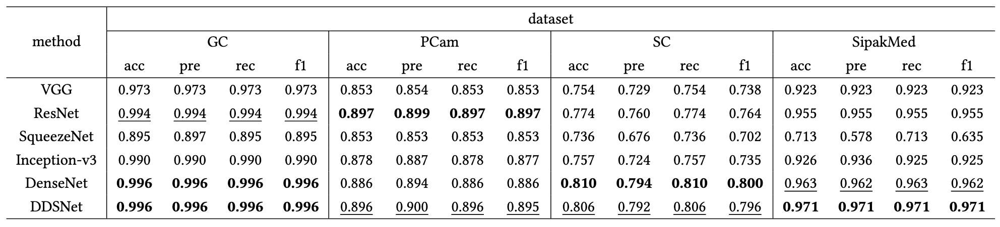
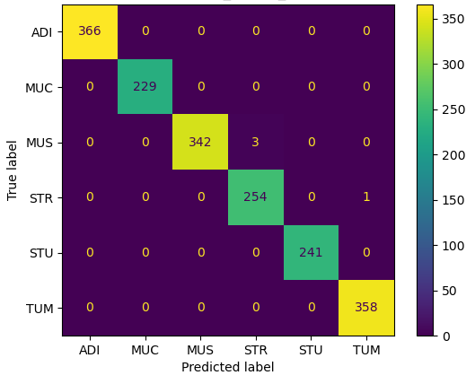
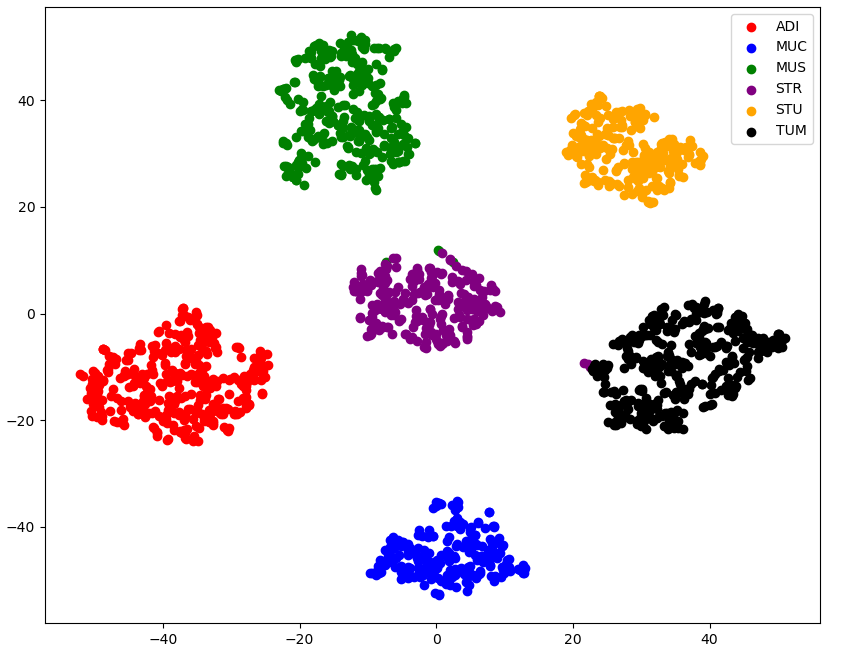

# DDSNet

This repository contains the official implementation of our paper:  
**"[DDSNet: A Lightweight Dense Depthwise Separable Network for Tumor Classification]"**  
📄 [Read the Paper](https://zuobinxiong.github.io/assets/pdf/SAC2025%20DDSNet%20CameraReady.pdf)

---

## 🧠 Abstract

Deep learning-based medical image processing plays a significant role in modern computer-aided diagnosis, which facilitates doctors in various disease analysis. 
However, most researchers focus on the accuracy of medical image classification tasks with ever-increasing model size and the number of parameters but overlook the high diagnostic costs and model efficiency. 
To reduce such costs and broaden the application scenarios, a low-cost and efficient medical image classification is imperative.
To achieve this goal, this paper designs a lightweight model, named Dense Depthwise Separable Network (DDSNet), which combines the merits of Dense Convolution Network and Depthwise Separable Convolution, rendering a low-cost and efficient medical imaging. 
Moreover, a quantization-based method is invented to deploy the proposed model on real-world IoT devices by converting the original model to an integer-type model while maintaining its classification performance.
Extensive experiments are conducted on four cancer image datasets on the IoT device, showing the promising performance of this proposed method against 5 baseline models, including data visualization and interoperability aspects.
Notably, compared to DenseNet, the proposed model is about 32$\times$ smaller and 5$\times$ faster after quantization, with a competitive classification accuracy preserved. 

---

## 🏗️ Model Architecture

Here’s the architecture of our model:


---

## 📊 Results

<p align="center">
  
</p>
<p align="center">
  
  
</p>

---

## 📁 Datasets

We used the following datasets for training and evaluation. You can download them from the links below:

- **[Gastrointestinal Cancer (GC)]**  
  🔗 [Download](https://zenodo.org/records/2530789)  

- **[PatchCamelyon (PCam)]**  
  🔗 [Download](https://www.kaggle.com/datasets/andrewmvd/metastatic-tissue-classification-patchcamelyon)  

- **[Skin Cancer (SC)]**  
  🔗 [Download](https://www.kaggle.com/datasets/farjanakabirsamanta/skin-cancer-dataset)  

- **[Cervical Cancer largest dataset (SipakMed)]**  
  🔗 [Download](https://www.kaggle.com/datasets/prahladmehandiratta/cervical-cancer-largest-dataset-sipakmed) 

---

## 🛠️ Setup & Usage

```bash
# Clone the repository
git clone https://github.com/OldDreamInWind/DDSNet.git
cd DDSNet

# Install required packages
conda env create -f environment.yml

# Train the model see more in /scripts
python main.py --mode 'eval' --input_channel 3 --output_channel 7 --dataset Skin --device 'cuda:0' --model 'DDS'

```
---

## Citation

If you use this code or model in your research, please cite our paper:

```bibtex
@inproceedings{huang2024ddsnet,
  title = {DDSNet: A Lightweight Dense Depthwise Separable Network for Tumor Classification},
  author = {Huang, An and Son, Junggab and Xiong, Zuobin},
  booktitle = {The 40th ACM/SIGAPP Symposium on Applied Computing},
  pages = {},
  year = {2024},
  organization = {ACM},
  doi = {https://doi.org/10.1145/3672608.3707780},
}
```